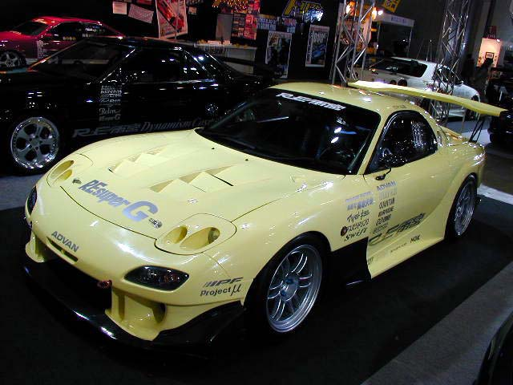
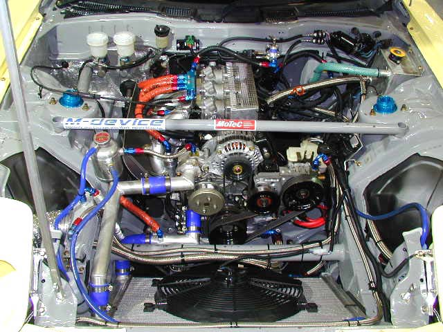

# RE rain palace wind forest volcano 3  NA

- Tsukuba Super Rap Nobuaki Taniguchi
  - DATE / TIME: 03/12/09 01'58"110

### Specification DATA
###### Power: 360 ps (355 Hp)
- Motec (AVO )
- Triple Throttle (Madevice)
- Transmission: 6 SPEEED (manufactured by HYULAND)
- RE Amemiya / One Off 3 Rotor NA
- RE Amemiya / One Off Special Engine
- RE Amemiya / 80  stainless steel dolphin tail muffler
- RE Amemiya / EX manifold 45  stainless steel
- RE Amemiya / Enhanced Separator Tank
- RE Amemiya / One Off Oil / Catch Tank
- RE Amemiya / One off air jack fitted
- RE Amemiya / One-off differential pump attachment
- RE Amemiya / Oil / filler cap
- CIRCUIT INTAKE NUMBER STAY
- RE Amemiya / RE Super G Oil 10 W - 40 (5 liters)

[Exterior parts](http://www.re-amemiya.co.jp/retuden/time_at/d_fd_3rotor_aero.html)

 RE Amemiya / AD FACER N1 (02 model) [No clear turn signal]
FENDER DIFFUSER[Wet Carbon] for AD GT KIT
{^CANARD-PRO for UNDER SWEEP [WetCarbon]
{^UNDER SWEEP [WetCaarbon]
 {^AD HOOD-9 [FRP]
 {^BONNET PIN (Silver)
 {^AD OVAL MIRROR
{^SLEEK AIR DUCT (L.R SET) B
RE Amemiya / REAR SPOILER GT 2 [FRP] + High Mount Stay [When first purchased]
 {^REAR FINSHER COVER [WetCarbon]
 {^DIFFUSER-PRO [WetCarbon]
{^BOWTECH GENERATOR [WetCarbon](SIDE&CENTER SET)
 {^OUTER HANDLE [Carbon Look]
RE Amemiya / WIPER ARM [Carbon Look] (front part)

#### Interior parts
 RE Amemiya / Quicky Knob
{^etkkqnkkadq
RE Amemiya / Column Meter Panel & Boost Meter Set
RE Amemiya / flat bottom
Bucket seat (made by BRIDE)
Meter: DASH LOGGER (manufactured by Motec)
Oil temperature, water temperature, (all made by Trust)

#### Underbody
 RE Amemiya / Quantum RS · Amemiya SPEC [Susquit]
RE Amemiya / rear rigid bar
RE Amemiya / Pyrrolo Wah Link
RE Amemiya / Full Pillow
{^ehm`kfd`qSDPPP
 Brake: F Brembo CALIPER 340  rotor
 Brake: R Brembo CALIPER 328 rotor
 Brake pad (made by Project Mu)

#### Tire
 Advan A 048(F255/40 -17R
255/4017)

#### Wheel
RE Amemiya / RP-F1 SBC (F9.5J-17) [Amemiya special color] (made by ENKEI)
RE Amemiya / RP-F1 SBC (R10J-17) [Amemiya special color] (manufactured by ENKEI)
