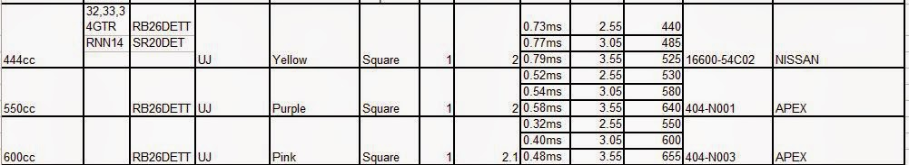

# BNR32 Notes

**KEY:**
- hz: times per second

##### Nissan Skyline GT-R BNR32 High-Level Info:
[Wiki page][wiki_linkbnr32] | [BNR32 Info][carfolio_link]
- Year 1989 – 1994
- Powerplant: [RB26DETT 2.6L Twin-Turbo](#RB26DETT_Engine)
- Wheelbase: 2,615 mm (103.0 in)
- Length: 4,545 mm (178.9 in)
- Width: 1,755 mm (69.1 in)
- Height: 1,341 mm (52.8 in)
- Curb weight: 1,430 kg (3,153 lb)
- Price: $30,000
- Drag coefficient: 0.4
- Drive: AWD [ATTESA E_TS][https://en.wikipedia.org/wiki/ATTESA#ATTESA_E-TS]
    - Control unit is 16 bit, Traction Status updated 10hz
- Problems: Oil system directs oil to head, if not mantained sludgebuild up can block return to block. 
- Best year:?

## Factory Spec:

### RB26DETT Engine
[wiki][rb26dett_wiki]
- 280hp
- 260tq

#### RB26 Block:
- Bore: 86mm (3.39in) 
- Stroke:  73.7 mm (2.9 in)
- crankshaft bearings: 7
- Compression Ratio: 8.5:1

#### RB26 Head:
- DOHC 24v
- To-Do: Get factory intake valve spec
- To-Do: Get factory Exhaust valve spec

#### Engine Coolant:
- Engine coolant: Water
- Unitary capacity: 428 cc

#### Lubrication System:
- Lubrication System: Wet-Sump

### Fuel System:
- **Fuel injectors:**

    - OEM Yellow Tops
    - low impedance(2 ohm), so there is a resistor pack located on the right side of the engine compartment.
    - Above you can see at 2.55 kg/cm2 (36 psi) of fuel pressure the injector flows about 440 cc. 
    - At 3.05 kg/cm2 (43 psi) of fuel pressure it flows about 485 cc.
    - At 3.55 kg/cm2(50 psi) it flows 525 cc.
    - Don't get too crazy with the fuel pressure. Your fuel pump relief valve might end the fun soon
- Fuel Tank
- **Fuel Pump:** 195 L/hr
- Fuel Pulsator
- Fuel Pump Control Module
- Fuel Rail
- Fuel Pressure Regulator (FPR)
- Fuel Filter
- Fuel Lines
- ECU
- Fuel Pressure
- System Voltage
- Fuel Surge Tanks

### Forced Induction
- Turbo Chargers: T25-type ceramic
- 10 psi (Factory boost)
- Intercooler: Air-Air

### Transmission
- Gearbox: 5 speed manual
#### Gear Ratios
- 1st: 3.21
- 2nd 1.93
- 3rd 1.30
- 4th 1.00
- 5th: 0.75
- Final drive ratio: 4.11

#### Clutch
[how to identify Push VS Pull clucth engagement](https://www.gtrusablog.com/2015/11/push-vs-pull-clutch-nissan-skyline-gt-r.html)
- Push style clutch (1989-1992)
    - Advantages: 
        - Simple Release Bearing design
        - Simple Install & Removal
    - Disadvantages: 
        - Larger L dimention 
        - More cover deflection at release
- Pull style clutch (Later than February 3rd, 1993 )
    - Advantages: 
        - Less Deflection at release
        - Larger lever ratio possible lower bearing load
        - Simpler, Lower stress Diaphram spring design
        - possible larger OD
        - possible no lower cover fulcom element
        - high clamp load design possible
    - Disadvantages:
        - More complex release bearing design
        - More complex installation and removal procedures

### Chassis:
- Turning circle: 10.40 m

### Suspension:
- Front suspension:	I.CS.ARB.
- Rear suspension: I.CS.ARB.

### Wheel & Tire
- Wheel size front: 8J x 16
- Wheel size rear: 8J x 16
- Tyres front: 225/60 VR 16
- Tyres rear: 225/60 VR 16

### Brakes
[brake info][brakeinfo_link]
- Brakes F/R: VeDi/VeDi-S-ABS
- Front brake diameter: 296 mm x 32 mm
- Rear brake diameter: 297 mm x 18 mm

### Interior
- Steering Wheel DIA: 370mm

---

## Good Resources:

- [GTR Registry][gtrregistry_link]
    - Check Vin
    - How to read options
    - Brocures 
    - Differences between options/ years etc
- [Skyline.se Misc PDFs][skylineSE_link]
- [Factory parts (nengun)][nengun_link]
- [Matienance Manual][matienanceman_link]

- [Drop motor and subframe guide][dropsubframe_link]
- [remove rb26dett](https://howtune.com/articles/44-removing-the-rb26dett-on-a-nissan-skyline)
- [Misc guides, tutorials GTRUSABLOG](https://www.gtrusablog.com/2010/05/real-basics-nissan-skyline-gt-r-r32-r33.html)
<!-- https://www.gtr.co.uk/threads/engine-removal-guide-bnr32.52997/ -->
- [BNR32 Part weights](https://axleaddict.com/cars/R32-Skyline-Part-Weights)
- [Nismo Clubman Race Spec (Ideal build)](http://gtr-registry.com/en-r32-gtr-nismo-clubman-race-spec.php)

---

---

## Links
<!-- ____________________ Links ____________________ -->

<!-- BNR32 Wiki -->
[wiki_linkbnr32]:https://en.wikipedia.org/wiki/Nissan_Skyline_GT-R#Third_generation_(1989%E2%80%931994)

<!-- Misc Specs about bnr32, weight length rb26dett -->
[carfolio_link]:https://www.carfolio.com/specifications/models/car/?car=11627

<!-- RB26DETT Wiki -->
[rb26dett_wiki]:https://en.wikipedia.org/wiki/Nissan_RB_engine#RB26DETT

<!-- GTR Registry (lots of misc good info) -->
[gtrregistry_link]:http://gtr-registry.com/en-nissan-skyline-r32.php

<!-- Skyline.se (PDFS) -->
[skylineSE_link]:http://www.skyline.se/dokument/

<!-- Factory parts for sale -->
[nengun_link]:https://www.nengun.com/nismo/heritage-parts-skyline-r32-gt-r-bnr32

<!-- Regular matienance -->
[matienanceman_link]:https://www.importavehicle.com/blog/maintenance-requirements-for-1989-1994-nissan-skyline-gt-r

<!-- Brake info -->
[brakeinfo_link]:https://www.gtrusablog.com/2017/05/r32-skyline-gt-r-brake-rotors-weight.html

<!-- drop subframe & motor guide -->
[dropsubframe_link]:https://www.gtr.co.uk/threads/bnr32-engine-removal-guide.180145/